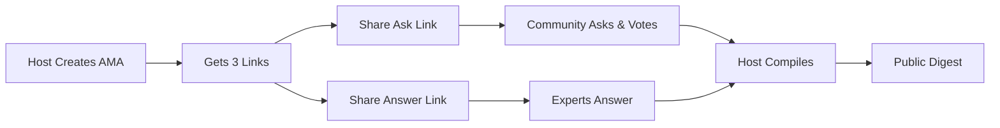

# 🎯 Explain-a-thon AMA Platform

> A lightning-fast, no-login AMA platform where experts break down complex topics through structured Q&A sessions. Built for the F1 Hackathon.

[](https://vercel.com/new/clone?repository-url=https://github.com/igoreydman/f1-hackathon-EAT&env=DATABASE_URL,NEXT_PUBLIC_BASE_URL)

## 🚀 What is Explain-a-thon?

Explain-a-thon is a minimalist AMA (Ask Me Anything) micro-app that lets you drop an async Q&A session into any community in seconds. No accounts, no setup complexity - just three shareable links and a clean digest at the end.

### The Problem It Solves

Traditional AMAs are chaotic:
- Live sessions require everyone online at once
- Forum threads get messy and hard to follow
- Good questions get buried
- Answers lack structure
- No clean summary for those who missed it

### Our Solution

**Three links. One digest. Zero friction.**

1. **Hosts** create an AMA and get 3 unique links
2. **Community** asks questions and votes (Ask link)
3. **Experts** provide structured answers (Answer link)
4. **Everyone** gets a clean, shareable digest


## ✨ Key Features

### For Hosts
- **Instant Setup**: Create an AMA in 30 seconds
- **Full Control**: Hide spam, publish when ready
- **Share Links**: Copy and distribute three simple URLs
- **Clean Digest**: One-click compilation to shareable summary

### For Experts
- **Structured Answers**: 3-part format (Core, Steps, Limitations)
- **Async Friendly**: Answer on your schedule
- **Credit & Attribution**: Your name on every answer
- **No Account Required**: Just click the Answer link

### For Community Members
- **Ask Questions**: 140-character focused questions
- **Vote on Questions**: Surface what matters most
- **Real-time Updates**: See new questions and votes
- **Read Digest**: Clean summary of all Q&As

## 🏗️ Architecture

### Tech Stack
- **Frontend**: Next.js 14 with TypeScript
- **Styling**: Tailwind CSS with dark theme
- **Database**: SQLite (dev) / PostgreSQL (prod)
- **ORM**: Prisma
- **Hosting**: Vercel (recommended)

### Design Principles
- **No Authentication**: Link-based access only
- **Constraint-Driven**: 140-char questions, 3-bullet answers
- **Tarpit Resistant**: Built to stay simple (8/10 anti-complexity score)
- **Mobile First**: Fully responsive design
- **Accessibility**: AA compliant contrast and keyboard navigation

## 🎮 How It Works



### The Flow

1. **Create**: Host enters topic & deadline → receives 3 unique links
2. **Ask**: Community submits questions (140 chars) and upvotes
3. **Answer**: Experts provide structured 3-part answers
4. **Compile**: Host publishes final digest
5. **Share**: Clean, readable summary for everyone

## 🚦 Quick Start

### Local Development

```bash
# Clone the repository
git clone https://github.com/igoreydman/f1-hackathon-EAT.git
cd f1-hackathon-EAT

# Install dependencies
npm install

# Set up database
npx prisma generate
npx prisma db push

# Run development server
npm run dev
```

Visit http://localhost:3000

### Deploy to Production

#### Option 1: One-Click Deploy
Click the "Deploy with Vercel" button above

#### Option 2: Manual Deploy
```bash
# Install Vercel CLI
npm i -g vercel

# Deploy
vercel

# Add database in Vercel Dashboard
# Settings → Storage → Create Database → Postgres
```

## 🔧 Configuration

### Environment Variables

```env
# Database (SQLite for dev, PostgreSQL for prod)
DATABASE_URL="file:./dev.db"

# Base URL for link generation
NEXT_PUBLIC_BASE_URL="http://localhost:3000"
```

### Production Setup

1. Deploy to Vercel
2. Add Vercel Postgres (free tier)
3. Set environment variables
4. Done! No external services needed

## 📊 Use Cases

Perfect for:
- **Technical Teams**: Architecture decisions, post-mortems
- **Communities**: Expert Q&A sessions, AMAs
- **Education**: Office hours, topic deep-dives
- **Events**: Conference Q&A, workshop follow-ups

## 🎯 Design Constraints

What makes this tarpit-resistant:

### Hard Limits
- 140 character questions
- 3 bullet answers only
- 5 host controls maximum
- No editing after publish

### What We DON'T Have
- ❌ User accounts or profiles
- ❌ Settings or configuration pages
- ❌ Rich text editing
- ❌ File uploads
- ❌ Real-time updates
- ❌ Analytics dashboards
- ❌ Email notifications

These aren't bugs - they're features that keep the app simple and focused.

## 🏆 F1 Hackathon Submission

**Team**: EAT (Explain-A-Thon)
**Category**: Productivity Tools
**Problem**: Async knowledge sharing is broken
**Solution**: Three links, structured answers, zero friction

### Why We'll Win
1. **Actually Ships**: Full working product, not a prototype
2. **Real Problem**: Every community needs better Q&A
3. **Elegant Constraints**: Simplicity through design, not limitation
4. **Production Ready**: Deploy in 5 minutes, scale to thousands

## 📈 Metrics & Success

The app succeeds when:
- AMA creation takes < 1 minute
- Question submission takes < 10 seconds
- 60%+ of questions get answered
- Digest gets 100+ views in 48 hours
- Zero login friction

## 🤝 Contributing

We keep it simple:

1. Fork the repo
2. Create your feature branch
3. Make changes (respect the constraints!)
4. Submit a PR

**Remember**: Every feature request gets a "no" by default. This is a feature, not a bug.

## 📜 License

MIT - Use it however you want

## 🙏 Acknowledgments

- Built with Next.js, Tailwind, and Prisma
- Deployed on Vercel
- Designed to resist feature creep
- Inspired by the best AMAs that never happened because the tools were too complex

---

## 🎬 Live Demo

Try it yourself:
1. Go to [your-deployment].vercel.app
2. Create an AMA
3. Share the links
4. Watch the magic happen

**No signup. No downloads. No complexity.**

Just questions, answers, and knowledge shared.

---

*Built in 1 hour 40 minutes (4:50PM - 6:30PM EST) for F1 Hackathon. Proof that the best products are simple, focused, and ship fast.*